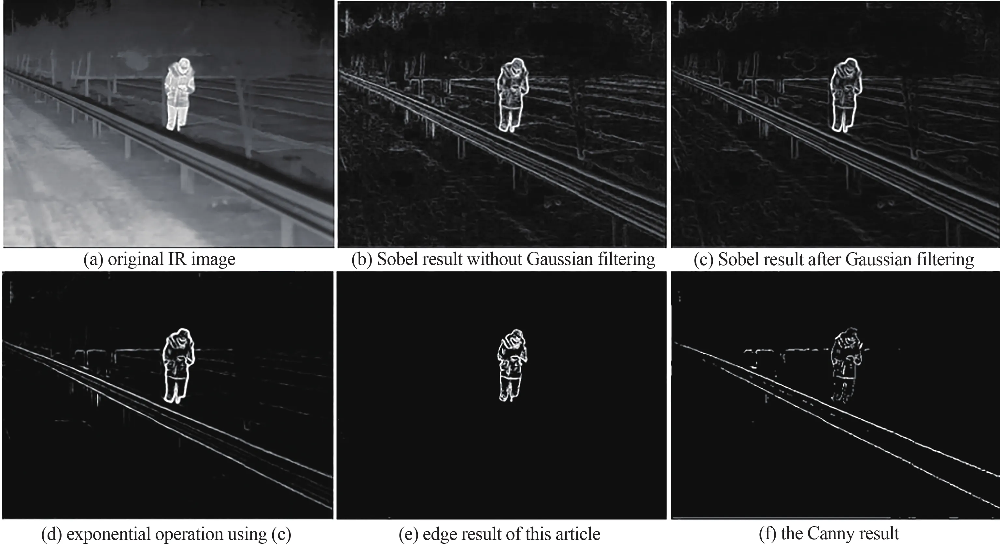
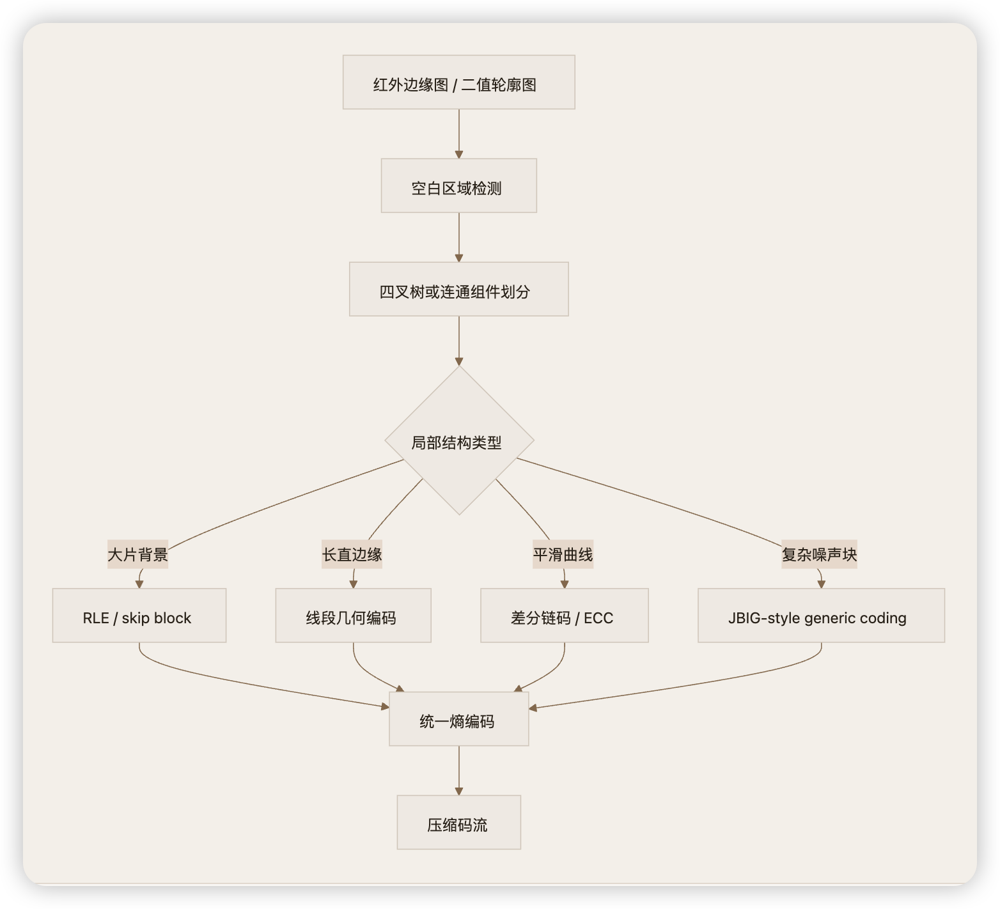
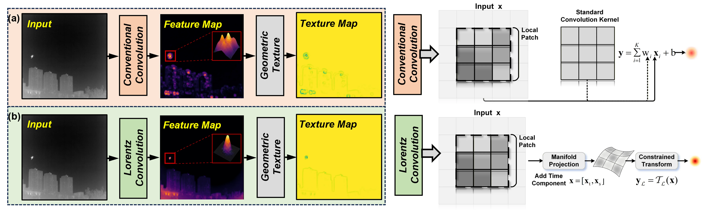

# 红外轮廓图像压缩 — 当前问题与待确认事项

> 2026-07-06 整理，用于与老师讨论下一步方向

## 项目背景回顾

**核心目标**：在 2.4kbps 带宽约束下，实现 CIF 分辨率（352×288）@10fps 的轮廓视频压缩传输。

| 指标 | 目标值 |
|------|--------|
| 带宽 | 2.4 kbps |
| 分辨率 | CIF 352×288 |
| 帧率 | 10 fps |
| I 帧压缩率 | < 0.01 bpp（< 1014 bits/帧） |
| 视频平均压缩率 | ≈ 0.002 bpp |

当前阶段聚焦 **I 帧轮廓图像压缩**，目标是将单帧 352×288 的轮廓图像压缩至 0.01bpp 以下。

## 参考论文

- [红外轮廓图像压缩相关论文](https://www.researching.cn/ArticlePdf/m00078/2024/22/12/11.pdf)（2024，第22卷第12期）

## 当前存在的问题

### 问题 1：红外轮廓图像的本质定义

经过分析，**轮廓提取算法本身并不依赖"红外"特性**——无论输入是红外图像还是可见光图像，轮廓提取后的结果（边缘图）在结构上是类似的。

**需要确认：**
- "红外"这个限定是否意味着输入数据有特殊格式或特性？
- 还是说这只是描述应用场景（从红外摄像头获取图像后提取轮廓），实际压缩对象就是通用轮廓图像？

### 问题 2：应用场景与压缩动机

超低码率压缩（0.01bpp）的实现路径高度依赖应用场景：

| 场景 | 对压缩方案的影响 |
|------|-----------------|
| **带宽受限传输**（卫星/无人机/军事通信） | 需要实时编码、低延迟、容错 |
| **存储节省** | 可以离线编码，延迟不敏感 |
| **编码管线的一部分**（先压缩轮廓，再用于辅助其他任务） | 需要关注重建质量对下游任务的影响 |

**需要确认：** 压缩后的轮廓图像最终用于什么？是给人看（需要视觉可辨识），还是给算法用（需要保持拓扑结构准确）？

### 问题 3：轮廓图像的数值类型

这是**最关键的技术分歧点**，直接决定整个编码方案：

| 类型 | 数值范围 | 适用方案 | 0.01bpp 可行性 |
|------|---------|---------|----------------|
| **二值图** | 0/1 或 0/255 | JBIG2、游程编码、链码、轮廓跟踪编码 | 相对可行 — 轮廓线本身稀疏 |
| **灰度图** | 0-255 | JPEG/HEVC 等传统方案（效果极差） | 极其困难 — 信息量远大于二值 |

**需要确认：** 轮廓提取的输出是二值图（边缘/非边缘）还是灰度图（边缘强度）？

## 候选方案

大部分轮廓信息编码的算法主要围绕链码方法，是针对二值轮廓图像的。

### 红外轮廓提取方法

使用 Sobel 算子从红外图像中提取边缘轮廓，效果如下图所示：

### 二值边缘图像编码方法概览

以下为二值边缘图像编码可选的方法：

### 可学习链码（Learnable Chain Code）

**参考论文：** [Context Adaptive Extended Chain Coding for Semantic Map Compression (ECC)](https://arxiv.org/abs/2603.03073)（Yang et al., 2026, eess.IV）

- **核心思路**：基于链码（Chain Code）的轮廓跟踪编码，提出扩展链码（ECC）更紧凑地表示长程轮廓转换，保留传统 3OT 链码作为 fallback
- **熵编码**：上下文自适应的马尔可夫模型 + 熵编码
- **skip-coding**：消除相邻语义区域间共享轮廓的冗余
- **效果**：比 SOTA 减少 18% 比特率，编解码运行时间减少 98%/50%
- **开源代码**：[InterDigitalInc/LosslessSegmentationMapCompression](https://github.com/InterDigitalInc/LosslessSegmentationMapCompression)
- **与本项目关联**：语义地图的轮廓与红外轮廓图像结构类似，链码方案可直接迁移

### 红外小目标检测方法迁移（洛伦兹空间）

对于红外图像压缩，可以参考红外小目标检测（IRSTD）领域的特征表示方法。

**参考论文：** [LoHGNet: Infrared Small Target Detection through Lorentz Geometric Encoding with High-Order Relation Learning](https://arxiv.org/abs/2605.07213)（Ma et al., 2026, cs.CV）

- **核心思路**：将特征从欧氏空间转换到洛伦兹空间（双曲几何/洛伦兹流形），利用双曲空间的几何性质更好描述弱目标的细微差异和目标-背景关系
- **关键模块**：
  - 几何注意力引导的洛伦兹残差卷积模块（GA-LRCM）：在双曲几何约束下做特征建模
  - 高阶关系学习模块（HORL）：通过对数映射将双曲特征映回欧氏切空间，用超图建模目标-背景的高阶上下文依赖
- **与本项目关联**：红外轮廓图像中的弱边缘信息与红外小目标有类似的稀疏性特征，洛伦兹空间编码可能提供更紧凑的特征表示，有利于超低码率压缩

洛伦兹卷积产生更尖锐紧凑的目标峰值，背景响应被有效压低。

## 下一步可能的方向

1. **确认数据格式** → 决定编码方案的基础
2. **获取测试数据** → 需要实际的红外轮廓图像/视频样本
3. **明确评估标准** → 用什么指标衡量压缩质量
4. **尝试 baseline** → 用最简单的方案（如游程编码）先估算压缩率下界
